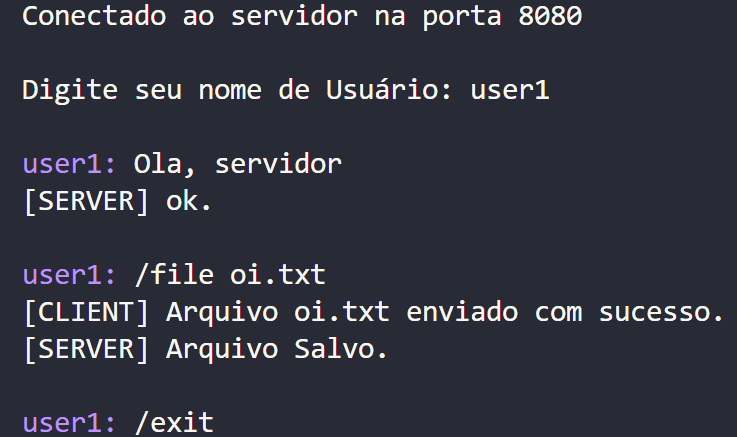
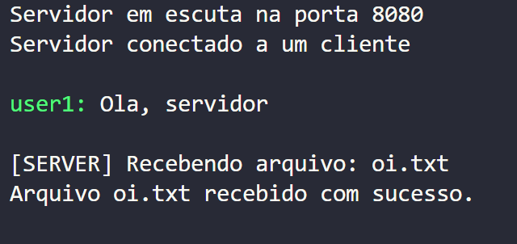

# Trabalho Camadas de Transporte e Aplicação

Repositório para o Trabalho da disciplina "SSC0142 - Redes de Computadores" do ICMC - USP.

## Grupo
| NUSP  | Nome |
| ------------- | ------------- |
| 13672220  | Camila Donda Ronchi  |
| 13837432  | Gabriel Sousa Santos de Almeida  |
| 13836813 | Lucas Piovani Ferreira |
| 13782369 | Luis Henrique Giorgetti Dantas |

## Descrição do Trabalho
O mecanismo	que	oferece	capacidade para	 troca de informações em rede mais utilizado atualmente é chamado socket. Um socket define um mecanismo de troca de dados entre dois ou mais processos distintos, processos estes que podem	estar em execução na mesma	máquina	ou em máquinas diferentes, porém ligadas em rede. Uma vez estabelecida à ligação entre dois processos por meio dos sockets, podem ser enviados dados em ambos os sentidos até que um dos pontos termine a ligação.

## Objetivo

O trabalho consistiu na criação de um sistema de comunicação cliente-servidor baseado em sockets TCP. Nosso objetivo principal foi estabelecer uma infraestrutura que permitisse a interação eficiente entre múltiplos clientes e um servidor central. 

Inicialmente, implementamos um socket TCP que serviu como canal de comunicação bidirecional. Isso possibilitou que os clientes se conectassem de forma confiável ao servidor, estabelecendo sessões de comunicação robustas e seguras.

Um dos pontos cruciais do sistema foi o suporte para múltiplos clientes simultaneamente. Cada cliente foi capaz de se conectar e interagir com o servidor de maneira independente, garantindo que as comunicações de um não interferissem nas dos outros.

Além da troca de mensagens, desenvolvemos funcionalidades para o envio de arquivos entre clientes e servidor. Implementamos protocolos de transferência que asseguraram a integridade dos dados durante o envio e o recebimento dos arquivos.

Para melhor organização e identificação das mensagens recebidas, configuramos o servidor para exibir cada mensagem com o nome do respectivo cliente. Isso facilitou a compreensão e o gerenciamento das interações dentro do sistema.

Por fim, criamos uma estrutura de armazenamento no servidor, especificamente na pasta `serverArqs`, onde todos os arquivos enviados pelos clientes foram salvos de forma segura e organizada. Isso permitiu que o servidor gerenciasse e mantivesse os arquivos recebidos de maneira centralizada.

Essas funcionalidades combinadas resultaram em um sistema de comunicação cliente-servidor robusto, capaz de lidar com múltiplos usuários simultaneamente, troca de mensagens e transferência de arquivos de forma eficiente e organizada.

## Compilação

O trabalho foi desenvolvido em c/c++.

Dentro da pasta raiz do projeto rode primeiro o Servidor com:
> g++ server.cpp -o server

>./server

Depois rode quantos clientes desejar com:
> g++ client.cpp -o client

>./client

## Execução
Ao executar os comandos de compilação, será possível enviar mensagens e arquivos do cliente.

1. Digite o seu username

2. Digite a mensagem que desejar, podendo ser:

    2.1. Mensagem de texto

    2.2. Arquivo com o comando `/file <nome_arquivo>`

    2.3. Desconectar do servidor com o comando `/exit`

### Exemplo de cliente:

## Exemplo do servidor:
O servidor basicamente recebe informações dos clientes e printa-as na tela.

